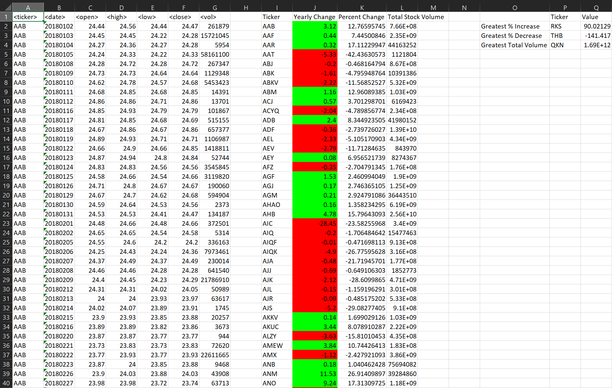
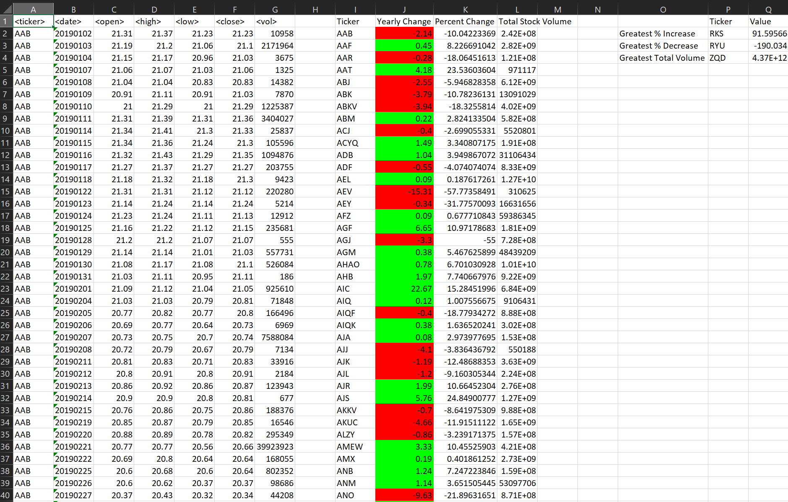
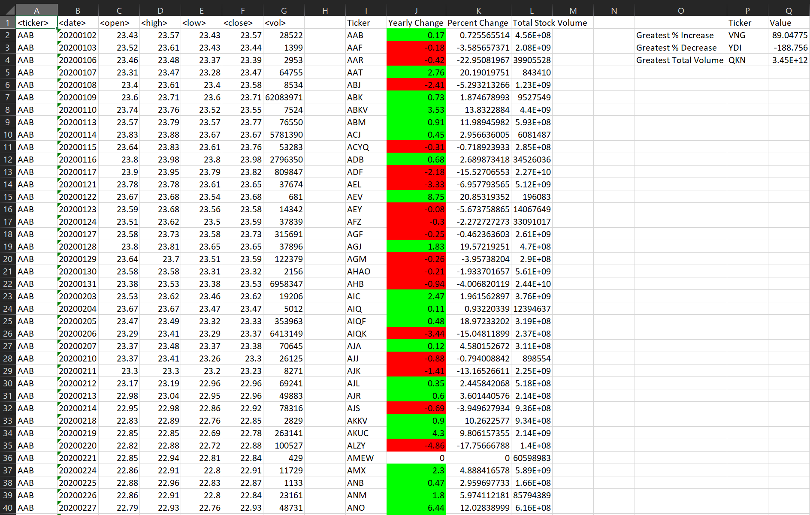

# The VBA of Wall Street
Use VBA scripting to analyze generated stock market data.

### Files
* [Stock Data](Resources/Multiple_year_stock_data.xlsx) - Run your scripts on this data to generate the final homework report.

### Stock Market Analyst

## Instructions

Create a script that loops through all the stocks for one year and outputs the following information:

  * The ticker symbol.

  * Yearly change from the opening price at the beginning of a given year to the closing price at the end of that year.

  * The percent change from the opening price at the beginning of a given year to the closing price at the end of that year.

  * The total stock volume of the stock.
    
  * Use conditional formatting that will highlight positive changes in green and negative changes in red.

## Bonus

Add functionality to your script to return the stock with the "Greatest % increase", "Greatest % decrease", and "Greatest total volume". The solution should match the following image:

Make the appropriate adjustments to your VBA script to allow it to run on every worksheet (that is, every year) just by running the VBA script once.

### Output Solution 
 Year: 2018

 Year: 2019

 Year: 2020

